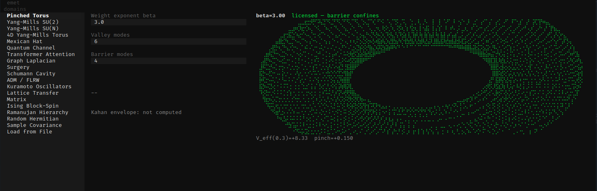

<p align="center">
  
</p>

<h1 align="center">emet</h1>

<p align="center">
  <a href="https://github.com/EmetLabsReal/emet/actions/workflows/ci.yml"></a>
  <a href="LICENSE"></a>
  <br />
  <a href="https://www.rust-lang.org/"></a>
  <a href="https://www.python.org/"></a>
</p>

Certified spectral reduction. Given a symmetric matrix and a partition, emet computes $\chi = (\lambda/\gamma)^2$ and tells you whether discarding part of your model is safe.

<p align="center">
  
</p>

## Install

```bash
git clone https://github.com/EmetLabsReal/emet.git && cd emet
uv venv && source .venv/bin/activate
uv pip install maturin numpy
maturin develop --release
```

## Usage

```python
import numpy as np, emet
from emet.certificate import certify

H = np.array([[4.0, 0.1, 0.2],
              [0.1, 3.0, 0.0],
              [0.2, 0.0, 5.0]])

r = emet.decide_dense_matrix(H, retained=[0, 1], omitted=[2])
cert = certify(H, retained=[0, 1], omitted=[2], report=r)

r["regime"]                    # "subcritical"
r["advanced_metrics"]["chi"]   # 0.0016
cert.seal                      # "a3f8..."
```

Licensed means the Schur complement preserves spectral structure with bounded error. The seal is a SHA-256 hash covering the operator, partition, and IEEE 754 floating-point envelope.

## CLI

```bash
emet decide my_model.json --json
emet certify my_model.json --pretty
```

## TUI

```bash
uv pip install "emet[tui]"
emet tui
```

18 built-in domains. Bring your own matrix as JSON. See [quickstart](docs/quickstart.md).

## Test

```bash
make test        # 274 tests (Rust + Python)
make examples    # runnable examples
```

## Docs

- [Quickstart](docs/quickstart.md) — install, first reduction, domain list
- [API reference](docs/api.md) — Python, Rust CLI, Rust library
- [Domain guide](docs/domains.md) — 18 adapters, writing a new adapter
- [Architecture](docs/architecture.md) — engine layers, phase portrait pipeline, data flow

## License

MIT
